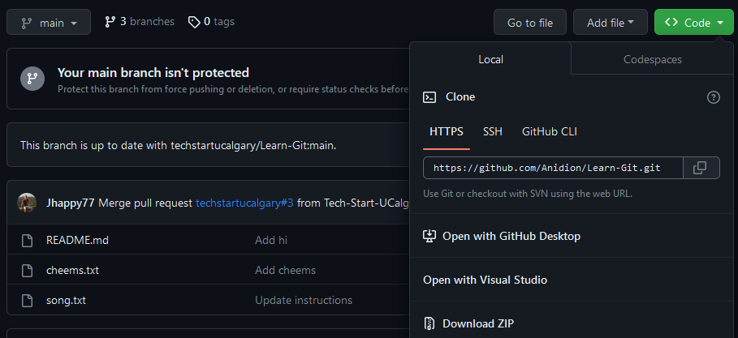

# Learn-Git

Exercises for learning how to use git. This is part of Tech Start UCalgary's git tutorial. You can see our slides here: <https://docs.google.com/presentation/d/1VirWHkI8QHIFB2E71R-vqGcnvhAHgFaG7yQ2FHZ677w/edit?usp=sharing>

Need more detailed documentation? Check out the [Tech Start Git Guide](https://docs.techstartucalgary.com/guides/Git_Guide/index.html)

## Exercise A

>Goal: Practice staging and committing changes

### A1: Setting up

Pre-requisites: you have installed Git on your computer, and you have a GitHub account

1. Fork the repository. This will create a new copy of the repository in your own GitHub account. To do this, follow these instructions.
   1. Go to [the repository](https://github.com/techstartucalgary/Learn-Git)
   2. Click `Fork` on the top right
   3. Uncheck `Copy the main branch only`
   4. Click `Create fork`
   5. Wait for the fork to load
2. Clone the forked repository on to your computer. To do this, follow these instructions.
   1. Click on the `<> Code` button on GitHub, then click the copy icon next to the URL
    
   2. Open up git bash, terminal or another command line interface
   3. Type `git clone` then copy the link in, then hit enter
3. Once you have cloned it, `cd` in the folder you created (`cd Learn-Git`). Type `git status` into your git console. If you are in the right place, then git should print a message like this:

```bash
On branch main
Your branch is up to date with 'origin/main'.

nothing to commit, working tree clean
```

Once you see this output, you're good to continue!

### A2: First commit

1. Edit the file called `song.txt`. There are multiple blank spots - denoted by the brackets with capitalized words like [NOUN]. Fill in these spots with the words of your choosing. Save it. Type `git status` - confirm that `song.txt` shows up as a "unstaged change" before continuing.
2. Follow the process we outlined in the slides to add this change and create a commit for it. Name your commit "Fill in the blanks". Type `git status` afterwards - you should see the same "nothing to commit" message as in [A1](#a1-setting-up), but this time your file is saved with the changes you made.
3. Replace the first line of `song.txt` with a bunch of garbage (ex: `iadjnigb21ehqpe;aifw3thr2npq;aneflr`). Then, stage your change, but don't commit it. Verify this with `git status`: you should see the file listed under staged changes.
4. Use the commands we learnt to take away the change from the staging area *without getting rid of the change*. Use `git status` to verify this worked (it should not be in staged files anymore, but you should still see your nonsense in the file itself). This means if you made other commits now, they would not include your change, but it's still there if you need it!
5. Use the commands we learnt to get rid of your change entirely, restoring the file to how it was at the most recent commit. Use `git status` to verify this.

### A3: `.gitignore`

1. Create a folder called secrets in your repository. Create a file in this folder called `secret` that contains your deepest darkest secret (like what you had for lunch yesterday)
2. Save [this image](https://external-content.duckduckgo.com/iu/?u=https%3A%2F%2Fwww.framerated.co.uk%2Ffrwpcontent%2Fuploads%2F2020%2F02%2Fbettercallsaul507_01.jpg&f=1&nofb=1&ipt=921d402872fd79317cfe9a7bcee5253244e174d8301e25a4a9b5a175b6e59076&ipo=images) as `jimmy.jpeg` in the repo's root folder.
3. Using `git status`, you should see indications of the new folder and files you added under untracked files. Once you do, continue to the next step.
4. Create a file called `.gitignore`. Your challenge is to add entries to this gitignore to achieve the following goals:
   - Nothing from the secrets folder should be committed
   - No image files that end with the exension .jpeg should be committed
   - Hint: you can use flags like *
   - Confused? [Help is here](https://www.atlassian.com/git/tutorials/saving-changes/gitignore#git-ignore-patterns)
5. Type `git status`. If you did the previous step correctly, the only file you should see now is your gitignore file. Once this is true, add it, and create a commit with it. Name this commit "Add gitignore".

## Exercise B

>Goal: Practice branching

1. Pick a short alias for yourself. For example, if your name was Dwayne Johnson, your alias could be dwayne, dwajo, or therock.
2. Create a new branch called `YOUR_ALIAS_HERE/addFrog`. ex: `dwayne/addFrog`
3. Switch to that branch. Make sure you are on that branch (type `git status`)
4. Add the following ASCII art at the end of `song.txt`, or add any ASCII art of your choosing:

```ascii
            _   _
          (.)_(.)
        _ (   _   ) _
      / \/`-----'\/ \
    __\ ( (     ) ) /__
    )   /\ \._./ /\   (
      )_/ /|\   /|\ \_(
```

5. Stage and commit your changes.
6. Switch back to your main branch. Is your ASCII art still there? Why or why not?
7. If you created a new branch from main, would it contain the frog? What about if you created a new branch while you were currently in `YOUR_ALIAS/addFrog`? Unsure? Try it out for yourself.
8. Create a new branch with a name of your choosing. Then try deleting it. If you deleted it successfully, you should not be able to switch to it with `git checkout`.

## Exercise C

>Goal: Practice pushing and pulling

### C1: Pushing your frog

1. Switch back to the branch where you created your frog
2. Using the commands you just learned, try pushing your frog to a branch on origin with the same name.
3. Visit your GitHub repo online. If your push was successful, you should see a new branch named `YOUR_ALIAS/addFrog`. If you don't see this, make sure you're looking at your fork. If you still don't see it, ask for help.

### C2: First pull request

1. From GitHub, create a pull request to merge your frog branch into the main branch. Make sure you're merging into the main branch of **your** repository, not the Tech Start one.
2. Complete the pull request.
3. Does your frog appear on main in the origin repo? Does your frog appear on main on your computer?
4. If the answer to the second question is no, then what should command could you do to change that?

## Exercise D

>Goal: Practice merge conflicts, whole workflow

### D1: Resolve a merge conflict

**Scenario**: 2 different brilliant individuals decided they would spice up this repository by adding some art of the lovable dog named Cheems (RIP). But since great minds think alike (and since software engineers have poor communication skills), they both did it at the same time without telling each other, and one of them merged to main - creating a merge conflict which prevents the second one from merging.

Using what you learned, your goal is to solve the merge conflict so that the second person, whose code is on the branch named `evilcheems`, can merge, and so that the following conditions are true:

- Cheems no longer has his evil eyebrows
- Both authors are credited for their work
- The poem in the evilcheems branch remains

Remember, use `git status` to confirm if the merge conflict is gone.

HINT: you will need to use `git pull origin main` from within the `evilcheems` branch to bring the merge conflict up on your local repo. From there, solve the conflict, and follow what you know about pull requests to merge it in to main.

### D2: Practice whole workflow

Using the Git workflow we just taught you (including branching, committing, pushing, pull requests, and pulling), practice a full cycle of making a change of your choice to this repository. Examples of changes you could make include adding a song2.txt, adding images, or stylizing existing files. Go crazy!
